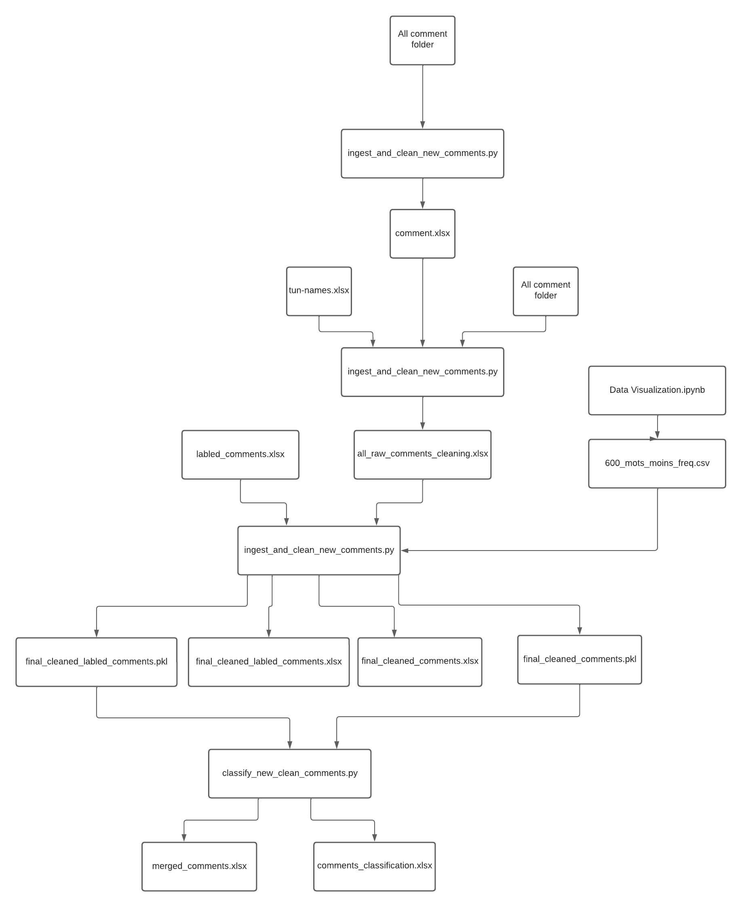

# Comments Classification NLP

This repository contains a 6-week internship NLP project focused on classifying comments from medical representatives. The main objective is to categorize the comments into three classes: 'Client' if the mentioned doctor or pharmacist is a client and prescribes the medicine, 'Test' if the concerned person is still testing it, and 'Réclamation' if there are any claims or complaints.

## How to run NOTEBOOKS?
1) Run the script process_new_comments.py (it will delete Doctors and Medicament names and will concat all comment files to comment.xls)
2) Run the Notebook Data Visualization.ipynb (to get 600_mots_moins_freq.csv as output which are the least frequent correlated words with the targers)
3) Run the Notebook Preprocessing_and_Modeling.ipynb (to clean the data and run the model LSTM chosen in our case result will be in Comments_Classification.xlsx)

## How to run Python Scripts?
0) open terminal in project with python installed required
1) pip install -r requirements.txt
2) cd src
3) python -m spacy download fr_core_news_sm
4) run python ingest_and_clean_new_comments.py (it will do the preprocess)
5) run python classify_new_clean_comments.py (it will predict with the LSTM model, the result will be in Comments_Classification.xlsx)

## The Project Overall 

The project consists of two notebooks located in the `src` directory:
- `Preprocessing_and_Modeling`: This notebook covers data cleaning tasks such as removing stop words and insignificant words, tokenization, lemmatization, and other preprocessing configurations. We have also implemented several models to classify the comments using a semi-supervised approach like XGBoost, LSTM, and Naive Bayes.
- `Data Visualization`: In this notebook, we identified the least correlated words with our targets and removed them.

The datasets used in the project are sourced from two files:
- `new_comment`: This file contains the data for training and testing our models and includes a single feature, 'comment'. new_comment is the the sum of all other files in All Comments directory.
- `labled_data`: This file contains the pre-labled data with predicted scores. It includes the 'comment' feature and the corresponding 'score' label.

The cleaned data is stored in `resources\dev_labo\data\processed\final_cleaned_Comments`. The final predictions (classification results) can be found in `resources\dev_labo\data\processed\Comments_Classification`.

To clean data from doctor names and medicine names, run `process_new_comments.py`.
Next, run `Data Visualization.ipynb` to obtain the output file `600_mots_moins_freq.csv`, which contains the least frequent words.
Finally, preprocess and train the data by running `Preprocessing_and_Modeling.ipynb`.

To correct predictions, add the correct prediction in the `manual_classification` column in `Comments_Classification.xlsx`, and then run `Preprocessing_and_Modeling.ipynb` to correct the model predictions.

!! Note that other models were put as commented because LSTM was the better to predict and no need to run others for better ressources management.

## Project Architecture

## Project Structure

- README.md
- requirements.txt
- resources
    - common
        - data
            - 600_mots_moins_freq.csv
            - Comments_Classification.xlsx
            - all_raw_comments_cleaning.xlsx
            - final_cleaned_Comments.pkl
            - final_cleaned_Comments.xlsx
            - final_cleaned_labled_Comments.pkl
            - labled_comments.xlsx
            - products.xlsx
            - tun-names.xlsx
    - dev_labo
        - data
            - new
                - All Comments
                    - comment.xlsx
                    - other.xlsx
                - comment.xlsx
            - processed
                - merged_comments.xlsx
- src
    - Data Visualization.ipynb
    - Preprocessing_and_Modeling.ipynb
    - classify_new_clean_comments.py
    - ingest_and_clean_new_comments.py
    - process_new_comments.py
    - xgbmodel
        - word2vec.model

## Credits

Internship Members:
- Karim Aloulou
- Nadia Bedhiafi

Internship Supervisor:
- Nizar Ellouze
